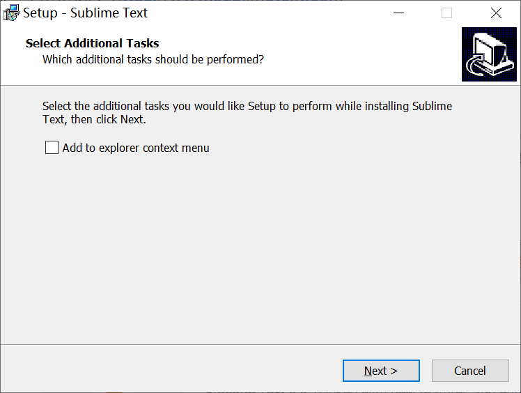

# sublime text 安装

## 介绍

sublime是功能类似vscode的代码编辑器，主要的功能是编辑，支持代码高亮和代码提示，并不直接提供运行代码的功能。

官网网址：[https://www.sublimetext.com](https://www.sublimetext.com/)

实际上必应就可以在第一条的位置轻松搜索到：

<figure><figcaption></figcaption></figure>

## 安装

官网可以一键下到安装包，下载后打开exe程序（exe是Windows通用的运行程序，常见于各类程序软件的启动和安装包）

第一个问题是是否将sublime添加到右键菜单，一般来说可以在文件管理器里选择文件和文件夹直接用sublime打开，推荐勾选，不是很重要。

<figure><figcaption></figcaption></figure>

然后程序会自动进行安装，安装目录建议选择Program Files文件夹，可以自己选择。最后点击Finish按钮后安装就完成了。

## 配置

因为sublime只是一个编辑器，刚安装完成时只有很有限的功能，所以需要另外配置和插件来实现更丰富的功能，其中最重要的功能主要是这两个：

1. 代码高亮
2. 代码提示

