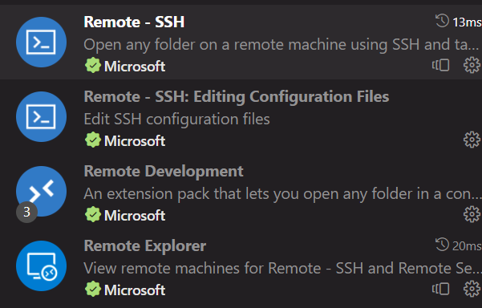

# 远程连接VSCode Server进行在线开发

## 准备：

首先你要准备如下几个插件：

<figure><figcaption></figcaption></figure>

安装完之后左侧菜单会增加一项窗口。

<figure><figcaption></figcaption></figure>

## 连接

点击+号添加ssh连接。

<figure><figcaption></figcaption></figure>

接下来就会有弹窗让你配置，指示做就可以了。

<figure><figcaption></figcaption></figure>

加完之后你的新ssh选项会显示在这个菜单中（如上上图所示），按右边的箭头或者新窗口就可以自动连接并打开。新窗口中还需要进行一定配置，然后输入密码，就可以直接使用。

<figure><figcaption></figcaption></figure>

## 终端

此外，通过右上角的小按钮或者快捷键Ctrl+J可以调出底部栏，其中可以使用终端，连接的终端也是服务器系统内的而不是本地的，可以直接调用服务器上的命令，比如node。
